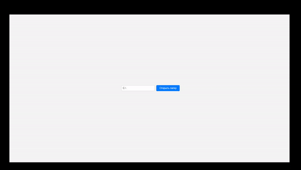

# Как из браузера открыть папку в проводнике Windows

> Представьте, у вас возникла необходимость прямо с локальной веб-страницы открывать папку с файлами. Но не просто отображать содержимое папки, а прямо на компьютере открывать проводник с этой папкой.



При использовании `<a href="file://C:/Users/123">открыть папку</a>` все современные браузеры блокируют запрос из-за CORS. 

Предлагаю решение данной проблемы через простой сервер `ExpessJS`.

## Установка

1. Убедитесь, что у вас установлен Node.js. Если нет, вы можете загрузить и установить его с [официального сайта Node.js](https://nodejs.org/).

2. Склонируйте репозиторий на ваш компьютер:

```bash
git clone https://github.com/suprunchuk/open-windows-folder-with-browser.git
```

3. Перейдите в каталог с проектом:

```bash
cd open-windows-folder-with-browser
```

4. Установите зависимости, включая Express:

```bash
npm install
```

5. Запустите сервер:

```bash
node server.js
```

После выполнения этих шагов сервер будет запущен на порту 3000 и готов обрабатывать запросы на открытие папок.

6. Откройте в браузере файл `index.html` из текущей папки, и введите в поле ввода ссылку на папку. Затем нажмите "Открыть папку".

```
C:\Users
```